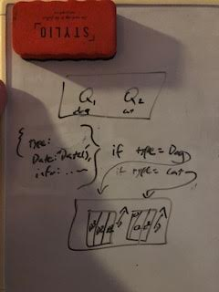

# Challenge Summary
Create a class called AnimalShelter which holds only dogs and cats. The shelter operates using a first-in, first-out approach.
## Challenge Description
Implement the following methods:
enqueue(animal): adds animal to the shelter. animal can be either a dog or a cat object.
dequeue(pref): returns either a dog or a cat. If pref is not "dog" or "cat" then return null.
## Approach & Efficiency
starting with the Queue system we built the other day, I created a new class that would house two queues labeled dogs and cats. from there it is just making sure the data input had a signifier to check and filter into the right queue.

## Solution
 
Upon enqueue and dequeue, check opbject animal type, then queue accordingly. 

