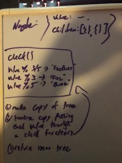

# Challenge Summary
<!-- Short summary or background information -->
work on k tree and make a function to fizzify a tree

## Challenge Description
<!-- Description of the challenge -->
    build function that returns a k tree copy where the values that are divisible by 3 and 5 get fizzbuzzed, etc., etc.
## Approach & Efficiency
<!-- What approach did you take? Why? What is the Big O space/time for this approach? -->
I ended up making a copy of the tree, then useed recursion to walk through applying a callback function to filter values as needed

## Solution
<!-- Embedded whiteboard image -->

[REPO](https://github.com/TrunkOfUkuleles/data-structures-and-algorithms/tree/FizzBuzzTree)