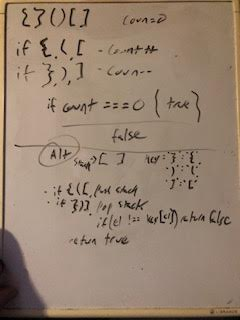

# Challenge Summary
Validate a string has a balanced number of brackets

## Challenge Description
create a function that, given a string, will return a boolean value if the string containes a balanced (complete pairs) of brackets

## Approach & Efficiency
I went with a counting approachg. By tracking if the three different opening and closing are there, you can assume a true will cancel them out - meaning I could check based on a 0 count. The better way I think is to track the openers with a stack so they cannot be shuffled together. 

## Solution

