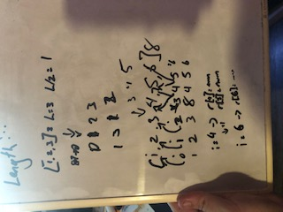
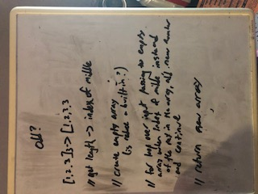

### Challenge Day 2

## Julien Edwards

Began the process sketching out my general idea. Most of the timeI assumed all built in methods meant any .<x> methods. 
So originally I had a for loop to hget the length, then used a for loop to iterate and make a new array. I allowed myself
the .length method, but the rest remained pretty vanilla. Testing I could not get done within the time alloted. So I think this is a decent foundation, but could not pass. I added the delete just because my method might make that easy, but was going to use the tests to check.

1. find length of arr
2. find middle index by halving length
3. for loop over arr, inserting each element at index of i into a new array at the index of i
4. when i=the input number, instead insert the number at the index of i
5. create a new for loop from that index to the end of the arr, inserting each element at index of i into a new array at the index of i+1
6. at the end of this for loop, break out of the first for loop
7. return new array

## time to complete: finsihed basic logic in an hour, but spent the rest of the time working on the tests

